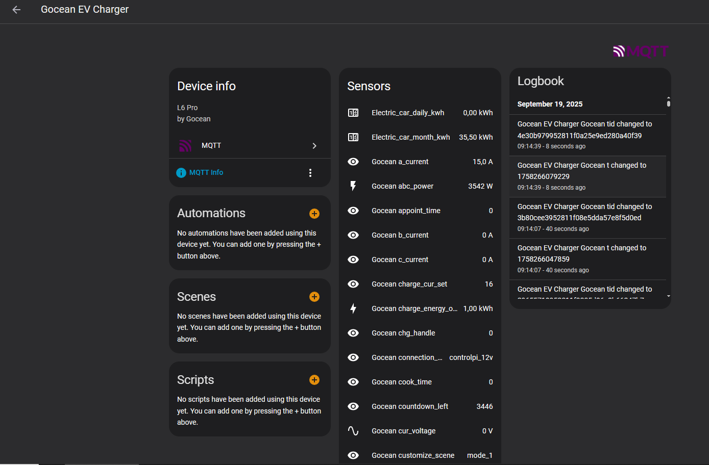
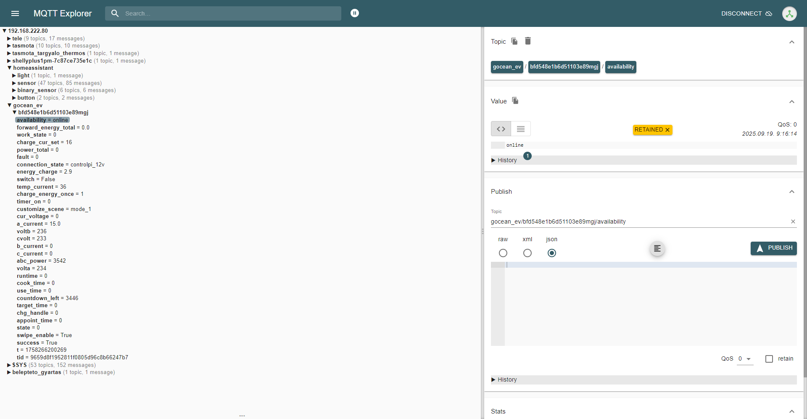

# Home Assistant Add-on: Gocean EV Charger (Tuya)

This Home Assistant add-on integrates the **Gocean EV Charger L6 Pro** (Tuya-based) and publishes real-time data to **MQTT** so that Home Assistant can automatically discover entities.

## Features
- Works in **Cloud** mode (via Tuya IoT API) or **Local** mode (via TinyTuya).
- Publishes all charger datapoints as MQTT topics.
- Supports **Home Assistant MQTT Discovery**, so sensors are created automatically.
- Scaling fixes:
  - `energy_charge` ÷100 → kWh
  - `forward_energy_total` ÷100 → kWh
  - `a_current` ÷10 → A
- Correct unit/device_class for `temp_current` (°C, temperature).

## Installation
1. Copy this repo into your Home Assistant `config/addons/local/gocean_ev/` folder.
2. In Home Assistant → Add-on Store → three-dots menu → **Check for updates**.
3. Install and start **Gocean EV Charger** add-on.

## Configuration Options
```yaml
mode: cloud             # or "local"
tuya_client_id: "xxxx"
tuya_client_secret: "xxxx"
tuya_region: "eu"       # "eu", "us", "cn", "in"
tuya_device_id: "deviceid"
local_ip: ""            # required for local mode
local_key: ""           # required for local mode
probe_versions: true
poll_interval: 30

mqtt_host: core-mosquitto
mqtt_port: 1883
mqtt_username: ""
mqtt_password: ""
mqtt_base_topic: ""
mqtt_discovery: true
force_discovery_on_start: true
```

## MQTT Topics
- Base topic: `gocean_ev/<device_id>` (or your configured `mqtt_base_topic`).
- Each Tuya code (e.g. `a_current`, `cur_power`, `temp_current`, `energy_charge`) is published under `base/<code>`.
- HA discovery topics: `homeassistant/sensor/<deviceid>_<code>/config`.

## Screenshots

### Entities in Home Assistant


### MQTT Topics


## Notes
- Requires an MQTT broker (e.g. Mosquitto add-on).
- For Cloud mode you must create a Tuya IoT project and link your Tuya app account to get `client_id` and `client_secret`.
- For Local mode you must obtain the device `local_key` and IP.

## License
MIT